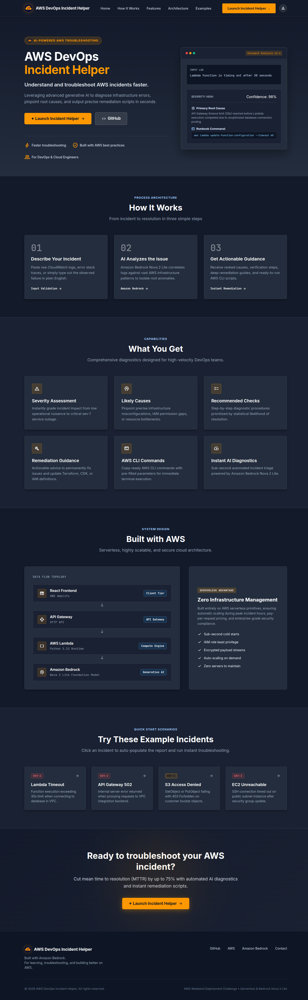
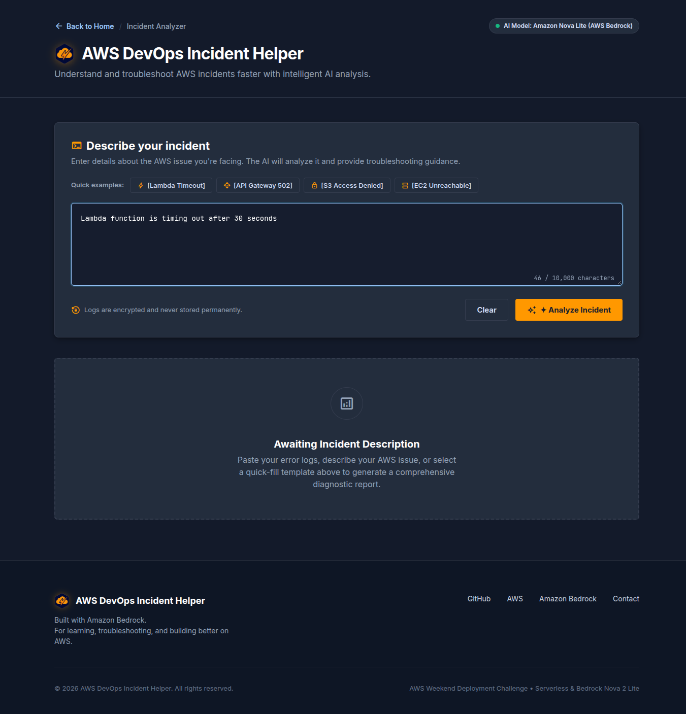
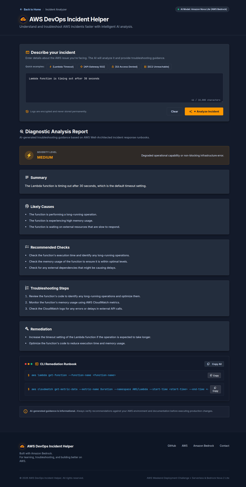
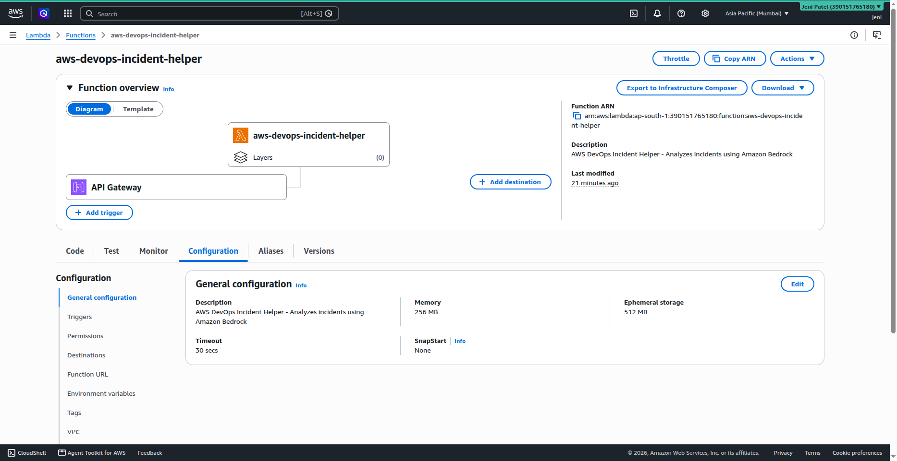
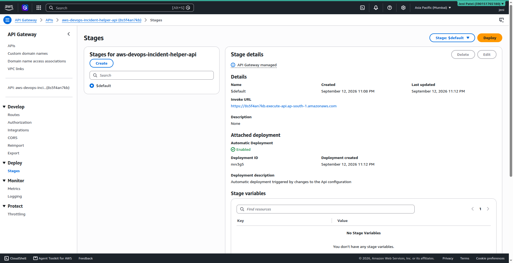
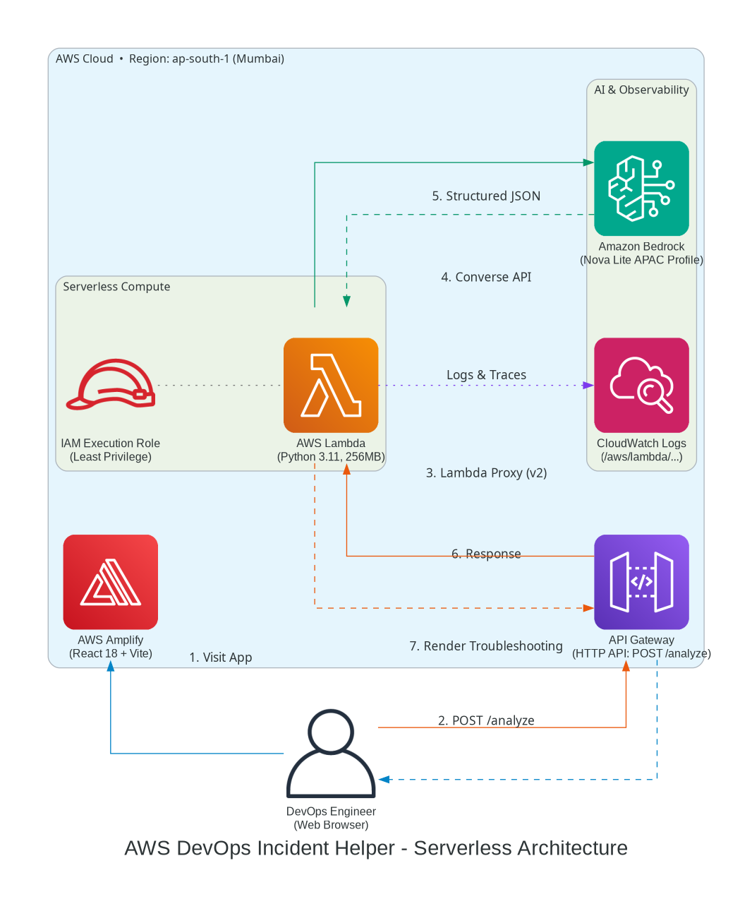

# AWS DevOps Incident Helper

An AI-powered serverless application that helps developers and DevOps engineers understand AWS and infrastructure-related errors and provides actionable troubleshooting guidance.

## 🚀 Live Demo

**Frontend:** https://main.d2v4zdm3pgizqg.amplifyapp.com

**API Endpoint:** https://8s5f4an7kb.execute-api.ap-south-1.amazonaws.com/analyze

## 📌 Project Overview

AWS DevOps Incident Helper is a lightweight web application where users can paste an error message, log output, or incident description. The application analyzes the input using Amazon Bedrock and generates a structured troubleshooting response.

The goal is to help developers quickly understand:
- What went wrong
- What might have caused it
- What they should check
- Which AWS commands may help
- How they can resolve the problem
- How to turn an investigation into a reusable incident report

## ✨ Features

- **Incident Description Analyzer**: Large textarea for pasting error messages, logs, or incident descriptions (up to 10,000 chars)
- **CloudWatch Log Analyzer**: Dedicated log parsing engine for pasting raw multi-line CloudWatch logs (up to 20,000 chars) with verbatim log evidence extraction
- **CLI Diagnostic Generator (`/cli-generator`)**: Safe, read-only AWS CLI command generator with copy and text runbook download capabilities
- **Incident Runbook Generator (`/runbook-generator`)**: Converts incident investigations into review-first operational runbooks
- **Incident Export & Reporting (`/incident-report`)**: Generates professional incident reports from manual input, analyzer results, logs, runbooks, CLI diagnostics, or local history
- **Incident History**: Client-side persistent storage with real-time keyword search, severity filtering, detailed inspection modal, and Slack/Jira markdown export
- **Report Export**: Copy full report, copy Markdown, download Markdown, download TXT, and browser print-to-PDF
- **Related Saved Incidents**: Automatically detects and surfaces relevant prior incidents when analyzing new issues
- **AI Analysis**: Powered by Amazon Bedrock (Nova Lite via APAC inference profile)
- **Structured Response**: Standard incidents, CloudWatch logs, CLI diagnostics, runbooks, and incident reports use structured JSON
- **Responsive UI**: Clean, AWS-inspired console aesthetic with intuitive tabs, code copy buttons, and responsive design
- **Security & Privacy**: Zero server-side incident persistence, zero direct AWS account access, and client-side history storage

## 🏗️ Architecture

```
User Browser (React + Vite on AWS Amplify)
    │
    │  Client-Side: LocalStorage Incident History & Related Matches
    ▼
Amazon API Gateway (HTTP API - POST /analyze)
    │
    ▼
AWS Lambda (Python 3.11, 256MB, 30s)
    │
    ├── analyze incident
    ├── analyze CloudWatch logs
    ├── generate CLI diagnostics
    ├── generate runbook
    └── generate incident report
    │
    ▼
Amazon Bedrock (Nova Lite via APAC Inference Profile)
    │
    ▼
Structured JSON
    │
    ├── Troubleshooting Analysis
    ├── CLI Diagnostic Playbook
    ├── Operational Runbook
    └── Professional Incident Report
    │
    ▼
Browser (Interactive Explorer + Local History + Export)
```

### Incident Reporting Flow

```
Incident Analyzer ─┐
CloudWatch Logs ───┤
CLI Generator ─────┼──> Incident Report Generator ──> Markdown / TXT / Print
Runbook Generator ─┤
Incident History ──┘
```

### AWS Services Used

- **AWS Amplify** - Frontend hosting & continuous deployment
- **Amazon API Gateway** - HTTP API endpoint (`POST /analyze`)
- **AWS Lambda** - Serverless compute (Python 3.11, 256MB, 30s timeout)
- **Amazon Bedrock** - AI inference (Nova Lite `apac.amazon.nova-lite-v1:0`)
- **Amazon CloudWatch** - Monitoring & Lambda execution logs (privacy-hardened)
- **AWS IAM** - Least-privilege permissions

### Region

- **Primary**: `ap-south-1` (Asia Pacific - Mumbai)
- **Bedrock Model**: `apac.amazon.nova-lite-v1:0` (cross-region inference profile)

## 📡 API Specification

### 1. Analyze Incident Description

**Endpoint:** `POST /analyze`

**Request:**
```json
{
  "incident": "Lambda function is timing out after 30 seconds"
}
```

**Response:**
```json
{
  "severity": "MEDIUM",
  "summary": "...",
  "likely_causes": ["..."],
  "recommended_checks": ["..."],
  "troubleshooting_steps": ["..."],
  "remediation": ["..."],
  "aws_commands": ["aws lambda get-function --function-name <name>"]
}
```

### 2. Analyze CloudWatch Logs

**Endpoint:** `POST /analyze`

**Request:**
```json
{
  "action": "analyze_logs",
  "logs": "2026-09-13T10:00:00.000Z Task timed out after 30.00 seconds\nREPORT RequestId: abc-123 Duration: 30000 ms..."
}
```

### 3. Generate CLI Diagnostics

**Endpoint:** `POST /analyze`

**Request:**
```json
{
  "action": "generate_cli",
  "service": "Lambda",
  "incident": "Lambda function is timing out after 30 seconds",
  "resource_name": "payment-processor",
  "region": "ap-south-1"
}
```

### 4. Generate Runbook

**Endpoint:** `POST /analyze`

**Request:**
```json
{
  "action": "generate_runbook",
  "title": "Lambda Timeout Incident",
  "service": "Lambda",
  "severity": "High",
  "description": "Lambda invocations are timing out..."
}
```

### 5. Generate Incident Report

**Endpoint:** `POST /analyze`

**Request:**
```json
{
  "action": "generate_incident_report",
  "title": "Lambda Timeout Incident",
  "service": "Lambda",
  "severity": "High",
  "description": "Lambda invocations are timing out...",
  "analysis": "...",
  "logs": "...",
  "diagnostic_commands": "...",
  "troubleshooting": "...",
  "remediation": "...",
  "verification": "...",
  "runbook": "...",
  "timestamp": "..."
}
```

The report response contains incident overview, executive summary, impact, symptoms, evidence, separated confirmed/probable/unknown root causes, troubleshooting, read-only commands, remediation, verification, rollback considerations, prevention, and a post-incident checklist.

## 🛡️ Incident Report Safety Rules

The report generator is review-first by design:

- Never invent AWS account IDs, ARNs, resource names, metrics, logs, or timestamps
- Never claim direct AWS account access
- Never present an unverified root cause as confirmed
- Diagnostic commands are sanitized as READ_ONLY
- Commands are never executed by the application
- No credentials, tokens, or access keys are requested or exposed
- Missing information is represented as `Information not provided.`

## 💾 Data & Privacy

Incident History remains in browser `localStorage`. The application does not add a database for reports. Report generation sends only the information the operator supplies to the existing API/Bedrock flow. Generated reports are not automatically persisted on the server.

Avoid storing production secrets, credentials, tokens, or sensitive customer data in browser history.

## 🛠️ Technology Stack

### Frontend
- React 18
- Vite
- JavaScript (ES6+)
- CSS3

### Backend
- Python 3.11
- AWS Lambda
- boto3 (AWS SDK for Python)

### AI
- Amazon Bedrock
- Amazon Nova Lite (via APAC inference profile)

### Infrastructure
- AWS Amplify
- Amazon API Gateway
- AWS IAM
- Amazon CloudWatch

## 🔐 Security

- **Least Privilege IAM**: Lambda only has permissions to invoke the configured Bedrock model and write CloudWatch logs
- **No Hardcoded Credentials**: All credentials managed via IAM roles
- **Input Validation**: Server-side validation of user inputs and payload size
- **CORS Configuration**: Configured for the deployed frontend/API integration
- **No Secrets in Code**: No AWS credentials, API keys, or tokens in source code
- **Command Sanitization**: Generated diagnostic commands are filtered for state-changing operations
- **No Automatic Execution**: AWS CLI commands are displayed only as operator-reviewed guidance
- **Safe Rendering**: Incident report content is rendered as React text rather than trusted HTML

## 💰 Cost Strategy

This project uses inexpensive serverless services:
- AWS Amplify (free tier eligible)
- Amazon API Gateway (free tier eligible)
- AWS Lambda (free tier eligible)
- Amazon Bedrock (pay per request)
- Amazon CloudWatch (free tier eligible)

No EC2, RDS, ECS, OpenSearch, NAT Gateway, or Load Balancers used.

## 🧪 Testing

### Existing Test Scenarios

1. **Lambda Timeout**: "Lambda function is timing out after 30 seconds"
2. **API Gateway 502**: "API Gateway returns 502 Bad Gateway"
3. **S3 Access Denied**: "AccessDeniedException when uploading an object to S3"
4. **Empty Input**: Validates minimum length requirement
5. **Invalid JSON**: Handles malformed requests gracefully
6. **Very Long Input**: Validates maximum length requirement
7. **Incident Report**: Generates structured report from supplied incident information
8. **Missing Report Fields**: Uses explicit missing-information handling
9. **Read-only Command Sanitization**: Removes state-changing diagnostic commands
10. **Markdown/TXT Export**: Verifies browser-side report export
11. **History Report Flow**: Loads a saved local incident into the report generator

## 📁 Project Structure

```
aws-devops-incident-helper/
│
├── frontend/
│   ├── src/
│   │   ├── components/
│   │   ├── pages/
│   │   │   ├── IncidentReportPage.jsx
│   │   │   └── ...
│   │   ├── utils/
│   │   ├── App.jsx
│   │   ├── main.jsx
│   │   ├── styles.css
│   │   ├── runbook.css
│   │   └── incident-report.css
│   ├── public/
│   ├── package.json
│   └── vite.config.js
│
├── backend/
│   ├── lambda_function.py
│   ├── requirements.txt
│   └── README.md
│
├── architecture/
│   └── architecture.txt
├── screenshots/
├── README.md
├── PRD.md
└── .gitignore
```

## 🚀 Deployment

### Prerequisites
- AWS CLI configured with appropriate permissions
- Node.js 18+ and npm
- Python 3.11+

### Backend Deployment

1. Package `backend/lambda_function.py`.
2. Deploy the Lambda function using the existing IAM role and Bedrock model configuration.
3. Ensure the API Gateway integration points to the updated Lambda.
4. Test `POST /analyze` with the existing incident, `analyze_logs`, `generate_cli`, `generate_runbook`, and `generate_incident_report` actions.

### Frontend Deployment

1. Build the frontend:
```bash
cd frontend
npm ci
npm run build
```

2. Deploy to AWS Amplify using the existing deployment workflow.

## 📸 Screenshots

1. **Application Homepage**
   

2. **User Entering an Incident**
   

3. **AI-Generated Incident Analysis**
   

4. **AWS Lambda Configuration**
   

5. **API Gateway Endpoint**
   

6. **AWS Architecture Diagram**
   

## 📚 What I Learned

- Creating a serverless application with AWS Amplify, API Gateway, Lambda, and Bedrock
- Configuring least-privilege IAM permissions for Bedrock inference profiles
- Handling cross-region Bedrock model access via inference profiles
- Parsing and validating AI model responses
- CORS configuration for API Gateway with Lambda proxy integration
- Building reusable incident investigation workflows
- Turning AI-assisted troubleshooting into structured operational documentation
- Designing review-first command generation and report exports
- Keeping incident history client-side without introducing a database

## 🏆 AWS Weekend Deployment Challenge

This project was built for the AWS Weekend Deployment Challenge, demonstrating:
1. Building a real serverless application
2. Deploying it on AWS using multiple services
3. Integrating Amazon Bedrock for AI-powered features
4. Making the application publicly accessible
5. Documenting the architecture and deployment process

## 🔮 Future Improvements

- AWS account-aware troubleshooting with explicit user permissions
- Incident history synchronization with DynamoDB
- User authentication with Amazon Cognito
- Slack/Teams integration for notifications
- ECS/EKS troubleshooting support
- CloudFormation/Terraform error analysis
- Human-approved automated remediation
- CI/CD pipeline integration

## 📄 License

MIT License - see LICENSE file for details.

## 🤝 Contributing

Contributions are welcome! Please read the contributing guidelines before submitting PRs.

---

**Built with ❤️ for the AWS Weekend Deployment Challenge**
